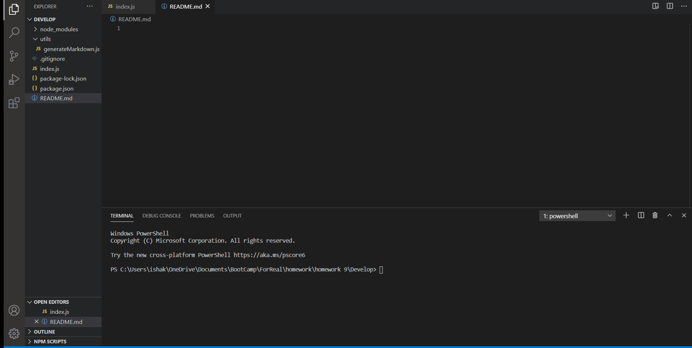

# README Generator 
  This application is designed to generate a quality README file based on user input. 
  ## Table of Contents
  * [Installation](#Installation)
  * [Demo](#demo)
  * [Contributors](#contributors)
  * [Questions](#questions)
   ## Installation 
  Clone repository from GitHub.
  ## Demo
 
  ## Contributors
  Isha Khosla is the primary author. They recieved help from Simon Rennocks.
  ## Questions 
  If you have any questions, I can be found on github at ishakhosla131, or emailed at ishakhosla131@gmail.com.
  ## Deployed app
  https://ishakhosla131.github.io/README-generator/.

